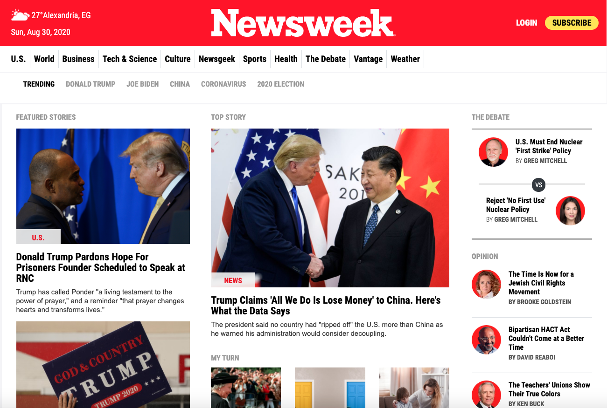

# Newsweek clone
 
This is the 7th collaborative project from Microverse program.
It is a clone of the Newsweek.com with main focus on using Bootstrap

## Built With :

 - HTML 
 - CSS
 - Bootstrap

## Demo Link:
[You can find the project live here](https://raw.githack.com/elasfarc/Newsweek-clone/homepage/index.html)

## Authors  

👤 Mohammed Al-Asfar

GitHub: [@elasfarc](https://github.com/elasfarc)

## 🤝 Contributing
Contributions, issues and feature requests are welcome!
Feel free to check the issues page.

## Show your support ⭐️
Give a ⭐️ if you like this project!  

## Acknowledgments
Hat tip to anyone whose code was used Inspiration etc 

## 📝 License 

This project is MIT licensed.
